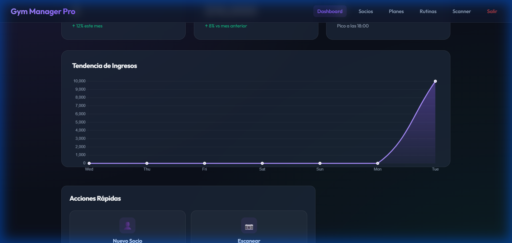
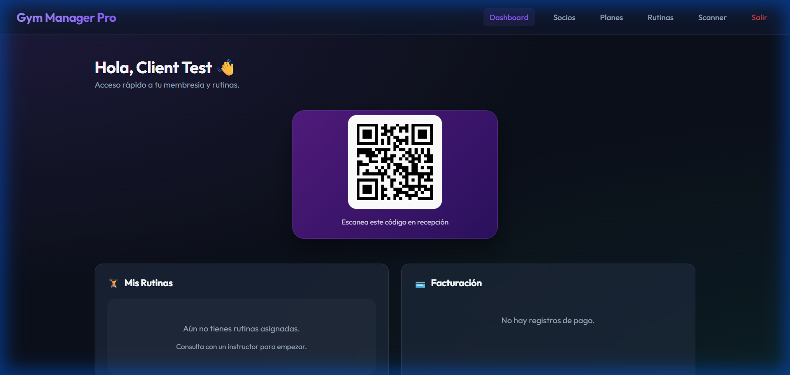

# 💎 Gym Manager Pro (Python Edition)

Bienvenido a la documentación oficial de **Gym Manager Pro**, una plataforma de gestión de gimnasios de alto rendimiento diseñada con una estética moderna y funcional.

---

## 🛠️ 1. Instalación y Puesta en Marcha

Sigue estos pasos para configurar el entorno y lanzar la aplicación en tu computadora local.

### Configuración del Entorno Virtual (`venv`)
Es fundamental usar un entorno virtual para mantener las dependencias aisladas.

1. **Abrir la terminal** en la carpeta del proyecto.
2. **Crear el entorno virtual**:
   ```powershell
   python -m venv venv
   ```
3. **Activar el entorno (Windows)**:
   ```powershell
   .\venv\Scripts\activate
   ```
   *(Si tienes problemas con permisos en PowerShell, usa: `Set-ExecutionPolicy -ExecutionPolicy RemoteSigned -Scope Process`)*

### Instalación de Dependencias
Con el entorno activo, instala las librerías necesarias:
```powershell
pip install -r requirements.txt
```
*(Si no tienes el archivo, instala manualmente: `pip install fastapi "uvicorn[standard]" sqlmodel jinja2 python-multipart argon2-cffi passlib pyjwt`)*

### Lanzamiento de la Aplicación
Para iniciar el servidor en modo desarrollo:
```powershell
uvicorn main:app --reload --host 0.0.0.0 --port 8000
```
- Acceso local: `http://localhost:8000`
- Acceso desde el celular: `http://<IP-DE-TU-PC>:8000` (Asegúrate de estar en la misma red Wi-Fi).

---

## 🚀 2. Funcionalidades del Sistema

### Administración y Control
- **Dashboard Elite**: Visualización de métricas de negocio con gráficos de tendencia de ingresos (últimos 7 días) impulsados por **Chart.js**.
- **Gestión de Membresías**: Creación de planes con duración y precios personalizados.
- **Control de Asistencia QR**: Escáner profesional con feedback sonoro (éxito/error) y visual basado en la cámara del dispositivo.
- **Alertas de Vencimiento**: Identificación visual automática de socios con cuotas próximas a vencer o ya expiradas.

### Gestión de Socios
- **Perfil Maestro**: Vista de 360° del cliente (Pagos, Rutinas, Asistencias y Datos Personales).
- **Asignación de Rutinas**: Los administradores pueden asignar ejercicios y rutinas específicas a cada socio.
- **Buscador Inteligente**: Filtro en tiempo real para localizar socios instantáneamente.



---

## � 3. Guía de Uso Útil

### Para el Dueño / Administradores
- **Control de Acceso**: Deja una tablet o celular en la recepción con la página `/scan` abierta para que los socios registren su entrada.
- **Seguimiento Financiero**: Revisa el gráfico del Dashboard diariamente para ver el flujo de caja.
- **Renovaciones Fáciles**: Usa el botón **"Pagar"** en la lista de socios para extender la membresía de un cliente en un solo click.

### Para los Socios (Clientes)
- **Instalación PWA**: Una vez que accedas desde el móvil, selecciona **"Agregar a la pantalla de inicio"** para tener el icono del gimnasio junto a tus otras apps.
- **Credencial Digital**: El socio tiene una tarjeta inteligente en su panel principal. Al tocarla, esta gira (**Flip 3D**) y muestra el código QR para el ingreso al gimnasio. No más carnets físicos.
- **Mis Rutinas**: El socio puede consultar su rutina de entrenamiento directamente desde su celular mientras entrena.



---

## 👨‍💻 Credenciales por Defecto
- **Admin**: `admin@gym.com` | `admin123`
- *(Al crear un nuevo usuario, la contraseña inicial es la que definas en el formulario)*

Desarrollado para ofrecer una experiencia tecnológica superior en la gestión deportiva.
